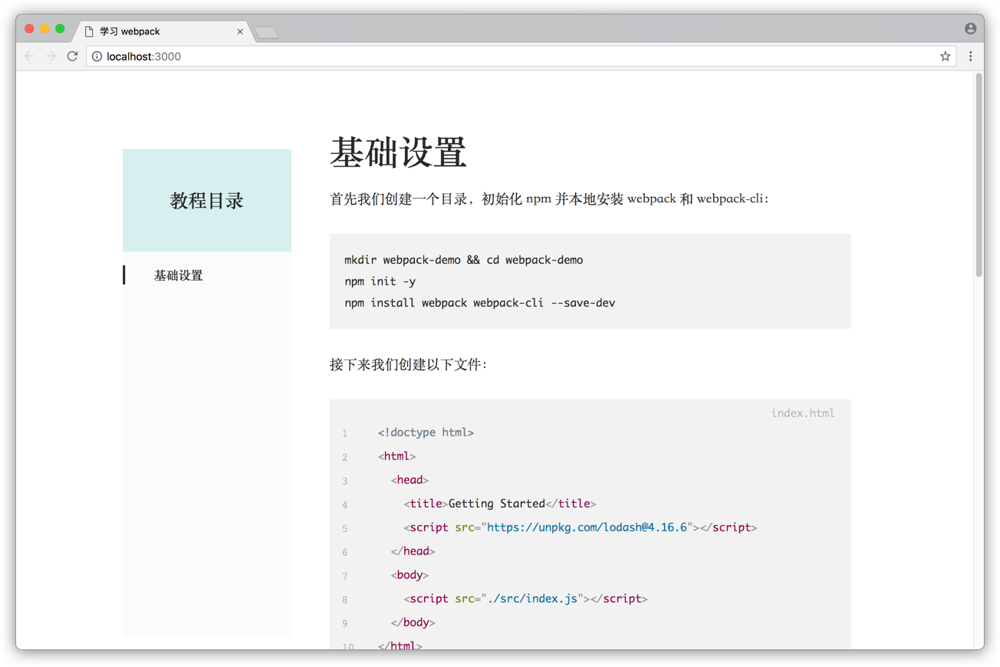

# 快速开始

写 Tuture 教程有两种方式：一种是从零开始，一步步写；另一种是将代码写完后才来写每一步的教程。我们将分别介绍两种写一篇 webpack 教程的方式。所写教程可以在[这个仓库](https://github.com/mRcfps/getting-started-with-tuture)查看。

## 从零开始写教程

### 初始化教程

首先我们创建一个目录用于写教程，并初始化 Git 仓库：

```bash
$ mkdir learning-webpack && cd learning-webpack
$ git init
```

接着我们初始化 Tuture 教程，输入 `tuture init` 命令（关于所有命令的使用方法，参考 [CLI 命令](/usage/cli-commands.zh-CN.md)）后，回答一系列关于教程基本信息的问题：

```bash
$ tuture init
✔ Tutorial Name … 学习 webpack
✔ Version … 0.0.1
✔ Tutorial Language › 简体中文
✔ Topics … webpack
✔ Maintainer Email … me@example.com
✔  success   Diff files are created!
✔  success   tuture.yml is created!
```

Tuture 初始化完成后，你会发现原来的目录里多了下面这些东西：

```
.
├── .gitignore
├── .tuture
│   └── diff.json
└── tuture.yml
```

下面分别介绍一下新增加的文件：

- `.gitignore`，这个文件大家都很熟悉了。Tuture 自动添加了忽略 `.tuture` 目录的规则，这里我们再添加一些 Node 项目的规则：

  ```
  .tuture
  node_modules
  ```

- `.tuture/diff.json` 记录了解析后的用于内部使用的 Git Diff 数据，在渲染教程时需要使用到。

- `tuture.yml` 是 Tuture 教程最重要的文件，它记录了关于教程的所有数据，在写讲解文字也是在此文件中：

  ```yaml
  name: 学习 webpack
  version: 0.0.1
  language: zh-CN
  topics:
    - webpack
  email: me@example.com
  steps: []
  ```

  关于它的详细说明，参考 [tuture.yml 详细说明](/usage/tuture-yml-spec.zh-CN.md)。如果你对 YAML 语法不太熟悉，推荐阅读[这一篇文章](http://www.ruanyifeng.com/blog/2016/07/yaml.html)。

### 编写代码

接下来便是写教程项目的代码了。

```bash
$ npm init -y
$ npm install webpack webpack-cli --save-dev
```

初始化好这个 npm 项目之后，我们添加 index.html：

```html
<!doctype html>
<html>
  <head>
    <title>Getting Started</title>
    <script src="https://unpkg.com/lodash@4.16.6"></script>
  </head>
  <body>
    <script src="./src/index.js"></script>
  </body>
</html>
```

还有 src/index.js：

```javascript
function component() {
  var element = document.createElement("div");

  // Lodash, currently included via a script, is required for this line to work
  element.innerHTML = _.join(["Hello", "webpack"], " ");

  return element;
}

document.body.appendChild(component());
```

这样我们的项目结构看起来是这样的：

```
.
├── .gitignore
├── .tuture
│   └── diff.json
├── index.html
├── node_modules
├── package.json
├── package-lock.json
├── src
│   └── index.js
└── tuture.yml
```

最后提交这一步的代码：

```bash
$ git add .
$ git commit -m "基础设置"
```

### 填写讲解

打开 tuture.yml，我们会看到它的内容增加了刚才的提交：

```yaml
name: 学习 webpack
version: 0.0.1
language: zh-CN
topics:
  - webpack
email: me@example.com
steps:
  - name: 基础设置
    commit: 90ef523
    diff:
      - file: index.html
      - file: package.json
      - file: src/index.js
```

每一个步骤 `step` 对应一次 commit（可以从 `commit` 字段看出来），然后 `name` 就是提交信息，`diff` 则是这一步中所有发生改变的文件。从这里我们可以看出，为了方便讲解，**我们尽量应该让每一步做一件事，不要在一次提交中做出太多修改**。

另外，我们可以发现有些文件没有被列出来，例如 .gitignore、package-lock.json 还有 tuture.yml 本身。实际上，tuture.yml 对一些文件自动进行了忽略（被忽略的列表可以查看[这里](https://github.com/tutureproject/tuture/blob/master/docs/TUTURE_YML_SPEC.zh-CN.md#diff)）。如果你确实需要在教程中展示这些文件，那么可以自行添加进 tuture.yml 中。

我们在这一步骤的最前面添加一些说明文字，指导读者创建用于学习 webpack 所需的内容。在 Tuture 中，所有说明文字都在 `explain` 字段中，并且可以使用 Markdown 语法：

````yaml

---
steps:
  - name: 基础设置
    commit: 90ef523
    explain:
      - 首先我们创建一个目录，初始化 npm 并本地安装 webpack 和 webpack-cli：
      - |-
        ```bash
        mkdir webpack-demo && cd webpack-demo
        npm init -y
        npm install webpack webpack-cli --save-dev
        ```
      - 接下来我们创建以下文件：
    diff:
      - file: index.html
      - file: package.json
      - file: src/index.js
````

这里 `explain` 字段是一个数组，表示有多段说明文字。如果只有一段说明文字，那么直接填在 `explain` 字段中即可，例如：

```yaml
explain: 唯一的一段说明文字
```

接下来我们为”基础设置“这一步骤的内容添加说明文字。tuture.yml 中 `diff` 字段里面的文件顺序是可以任意改变的，因此我们调整一下顺序便于讲解，并且为 package.json 添加说明：

````yaml

---
steps:
  - name: 基础设置
    commit: 90ef523
    explain:
      - 首先我们创建一个目录，初始化 npm 并本地安装 webpack 和 webpack-cli：
      - |-
        ```bash
        mkdir webpack-demo && cd webpack-demo
        npm init -y
        npm install webpack webpack-cli --save-dev
        ```
      - 接下来我们创建以下文件：
    diff:
      - file: index.html
      - file: src/index.js
      - file: package.json
        explain:
          post: 注意到我们把这个包标记为 `private`，并且去掉了原来的 `main` 字段，这是为了防止意外发布我们的代码。
````

之前我们写 `explain` 的时候，是填一个字符串或一个字符串数组，这样说明文字就会放在步骤或修改文件的前面。其实 `explain` 还可以是一个 mapping，包括 `pre` 和 `post` 两个键（都是可选的），`pre` 就是放在前面的说明文字，`post` 就是放在后面的说明文字。同样地，它们分别也可以填字符串或字符串数组。关于 `explain` 字段的详细说明，参考[这篇文档](/usage/tuture-yml-spec.zh-CN.md#explain)。

最后，我们为这一步骤添加总结文字。将此步骤的 `explain` 字段修改如下：

````yaml

---
steps:
  - name: 基础设置
    commit: 90ef523
    explain:
      pre:
        - 首先我们创建一个目录，初始化 npm 并本地安装 webpack 和 webpack-cli：
        - |-
          ```bash
          mkdir webpack-demo && cd webpack-demo
          npm init -y
          npm install webpack webpack-cli --save-dev
          ```
        - 接下来我们创建以下文件：
      post:
        - 在这个例子中，`<script>` 标签之间存在隐含的依赖。在运行之前，我们的 `index.js` 文件依赖于包括在页面中的 `lodash` 库。这是因为 `index.js` 从未显式声明对 `lodash` 的依赖，它认为全局变量 `_` 已经存在。
        - 这种管理 JavaScript 项目存在许多问题，让我们试着用 webpack 来解决。
    diff: ...
````

第一步就写好了！我们运行 `tuture up`，即可看到我们刚刚写的内容！



### 反复迭代

接下来写第二步骤，我们首先安装 `lodash`：

```bash
$ npm install --save lodash
```

然后将 src/index.js 修改如下：

```javascript
import _ from "lodash";

function component() {
  var element = document.createElement("div");

  // Lodash, now imported by this script
  element.innerHTML = _.join(["Hello", "webpack"], " ");

  return element;
}

document.body.appendChild(component());
```

将 index.html 修改如下：

```html
<!doctype html>
<html>
  <head>
    <title>Getting Started</title>
  </head>
  <body>
    <script src="main.js"></script>
  </body>
</html>
```

这一步写完之后，我们就可以提交了！

```bash
$ git add .
$ git commit -m "使用 webpack 管理依赖"
```

再一次，我们会发现 tuture.yml 自动增加了新的提交：

```yaml

---
steps:
  - name: 基础设置
    commit: 90ef523
    explain: ...
    diff: ...
  - name: 使用 webpack 管理依赖
    commit: 52390ef
    diff:
      - file: index.html
      - file: package.json
      - file: src/index.js
```

如果你的教程还在浏览器中渲染的话（并且没有关闭 `tuture up` 进程），那么你会看到浏览器自动加载刚刚对 tuture.yml 的修改。

然后填写我们第二步的说明文字，删去不需要展示的 package.json：

````yaml

---
steps:
  - name: 基础设置
    commit: 90ef523
    explain: ...
    diff: ...
  - name: 使用 webpack 管理依赖
    commit: 52390ef
    explain:
      pre:
        - 首先我们要微调项目结构，把源代码(`/src`)和发布代码(`/dist`)分开来。源代码是我们要编辑的代码。发布代码是构建过程产生的最小化、最优化的输出结果，并将最终被浏览器加载。
        - 为了让 `lodash` 打包进 `index.js`，我们需要本地安装这个库：
        - |-
          ```bash
          npm install --save lodash
          ```
      post: 一切完成后，运行 `npx webpack` 进行打包。在浏览器中打开 `index.html` 文件，就可以看到 Hello webpack！
    diff:
      - file: src/index.js
        explain: 让我们把 `lodash` 导入进来：
      - file: dist/index.html
        explain: 既然我们已经决定把所有脚本打包，我们需要更新 `index.html` 文件。删除掉引入 lodash 的 `<script>` 标签，并且修改另一个 `<script>` 标签来将我们打包后的脚本添加进来：
````

接下来写最后一步，添加 webpack.config.js：

```javascript
const path = require("path");

module.exports = {
  entry: "./src/index.js",
  output: {
    filename: "main.js",
    path: path.resolve(__dirname, "dist")
  }
};
```

提交这一步：

```bash
$ git add .
$ git commit -m "使用 webpack 配置文件"
```

填写说明文字：

````yaml

---
steps:
  - name: 基础设置
    commit: 90ef523
    explain: ...
    diff: ...
  - name: 使用 webpack 管理依赖
    commit: 52390ef
    explain: ...
    diff: ...
  - name: 使用 webpack 配置文件
    commit: cfadaa6
    explain:
      pre: 到了版本 4，webpack 可以不需要任何配置。但是通过配置文件，我们能实现非常复杂的设定功能，这比在命令行中指定要方便的多。让我们创建一个 webpack 配置文件：
      post:
        - 最后，我们开始用配置文件开始构建：
        - |-
          ```bash
          npx webpack --config webpack.config.js
          ```
        - 配置文件是 webpack 如此强大的关键因素，我们可以在配置中指定 loader、插件等等。参考[这篇文档](https://webpack.js.org/configuration)以学习更多配置。
    diff:
      - file: webpack.config.js
        section:
          start: 1
          end: 4
        explain:
          post: "`entry` 指定了打包的入口，告诉 webpack 依赖图的起点。"
      - file: webpack.config.js
        section:
          start: 5
        explain: "`output` 指定了打包后输出文件的设置，这里我们设定打包后的文件名为 `main.js`，放在 `dist` 目录下。"
````

有一个字段我们是从未见过的：`section`。它是用来指定某个 diff 文件的一部分，当代码文件非常长时，这个字段特别有用。在这里，我们将 webpack.config.js 拆成两部分讲解，第一部分是第 1 行到第 4 行，第二部分是第 5 行到末尾。关于 `section` 字段的具体信息，参考[这里](https://github.com/tutureproject/tuture/blob/master/docs/TUTURE_YML_SPEC.zh-CN.md#section)。

最终的 tuture.yml 如下：

````yaml
name: 学习 webpack
version: 0.0.1
language: zh-CN
topics:
  - webpack
email: me@example.com
steps:
  - name: 基础设置
    commit: 90ef523
    explain:
      pre:
        - 首先我们创建一个目录，初始化 npm 并本地安装 webpack 和 webpack-cli：
        - |-
          ```bash
          mkdir webpack-demo && cd webpack-demo
          npm init -y
          npm install webpack webpack-cli --save-dev
          ```
        - 接下来我们创建以下文件：
      post:
        - >-
          在这个例子中，`<script>` 标签之间存在隐含的依赖。在运行之前，我们的 `index.js` 文件依赖于包括在页面中的
          `lodash` 库。这是因为 `index.js` 从未显式声明对 `lodash` 的依赖，它认为全局变量 `_` 已经存在。
        - 这种管理 JavaScript 项目存在许多问题，让我们试着用 webpack 来解决。
    diff:
      - file: index.html
      - file: src/index.js
      - file: package.json
        explain:
          post: 注意到我们把这个包标记为 `private`，并且去掉了原来的 `main` 字段，这是为了防止意外发布我们的代码。
  - name: 使用 webpack 管理依赖
    commit: 52390ef
    explain:
      pre:
        - >-
          首先我们要微调项目结构，把源代码(`/src`)和发布代码(`/dist`)分开来。源代码是我们要编辑的代码。发布代码是构建过程产生的最小化、最优化的输出结果，并将最终被浏览器加载。
        - 为了让 `lodash` 打包进 `index.js`，我们需要本地安装这个库：
        - |-
          ```bash
          npm install --save lodash
          ```
      post: 一切完成后，运行 `npx webpack` 进行打包。在浏览器中打开 `index.html` 文件，就可以看到 Hello webpack！
    diff:
      - file: src/index.js
        explain: 让我们把 `lodash` 导入进来：
      - file: index.html
        explain: >-
          既然我们已经决定把所有脚本打包，我们需要更新 `index.html` 文件。删除掉引入 lodash 的 `<script>`
          标签，并且修改另一个 `<script>` 标签来将我们打包后的脚本添加进来：
  - name: 使用 webpack 配置文件
    commit: cfadaa6
    explain:
      pre: 到了版本 4，webpack 可以不需要任何配置。但是通过配置文件，我们能实现非常复杂的设定功能，这比在命令行中指定要方便的多。让我们创建一个 webpack 配置文件：
      post:
        - 最后，我们开始用配置文件开始构建：
        - |-
          ```bash
          npx webpack --config webpack.config.js
          ```
        - 配置文件是 webpack 如此强大的关键因素，我们可以在配置中指定 loader、插件等等。参考[这篇文档](https://webpack.js.org/configuration)以学习更多配置。
    diff:
      - file: webpack.config.js
        section:
          start: 1
          end: 4
        explain:
          post: "`entry` 指定了打包的入口，告诉 webpack 依赖图的起点。"
      - file: webpack.config.js
        section:
          start: 5
        explain: "`output` 指定了打包后输出文件的设置，这里我们设定打包后的文件名为 `main.js`，放在 `dist` 目录下。"
````

最后我们提交 tuture.yml 的改动：

```bash
$ git add tuture.yml
$ git commit -m "tuture: 提交 tuture.yml"
```

注意提交信息以 `tuture:` 开头时，tuture.yml 会忽略这次提交。

大功告成！

## 从现有仓库开始写教程

可能你会觉得边写代码边写教程会阻碍你思考，那也可以选择把代码写完了再写教程。或者也有可能你想把现有的一个仓库改造成教程。

同样以上面的 webpack 教程为例。我们从一个 Git 仓库开始，可以看到它的提交记录如下：

```bash
$ git log --oneline
cfadaa6 (HEAD -> master) 使用 webpack 配置文件
52390ef 使用 webpack 管理依赖
90ef523 基础设置
```

我们先通过 `tuture init` 命令初始化教程，然后就会得到生成的 tuture.yml 文件如下：

```yaml
name: 学习 webpack
version: 0.0.1
language: zh-CN
steps:
  - name: 基础设置
    commit: 90ef523
    diff:
      - file: index.html
      - file: package.json
      - file: src/index.js
  - name: 使用 webpack 管理依赖
    commit: 52390ef
    diff:
      - file: dist/index.html
      - file: package.json
      - file: src/index.js
  - name: 使用 webpack 配置文件
    commit: cfadaa6
    diff:
      - file: webpack.config.js
```

我们可以看到教程的基本结构和上一节基本一致，只不过 `diff` 文件的顺序不怎么一样，而且也没有 `explain` 字段。接下来我们要做的就是把它改得跟上一节写的一样即可。然后运行 `tuture up`，在浏览器中就能看到写好的教程。

同样地，我们最后也要把对 tuture.yml 的修改提交：

```bash
$ git commit -m "tuture: 提交 tuture.yml"
```
